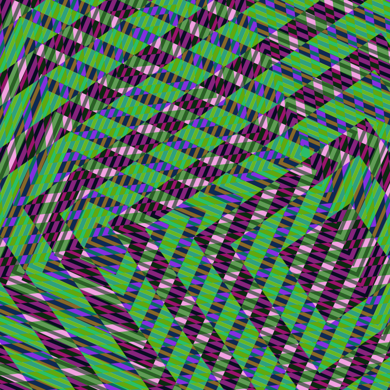

  <h1 align="center">
        Lost Shapes Dimension
  </h1>

  <h3 align="center">Un puzzle game avec des effet visuels de moiré</h3>

 

  

# Alerte 🚨
**CE JEU CONTIENT DES EFFETS VISUELS INTENSES, IL EST FORTEMENT DECONSEILLE A UN PUBLIC EPILEPTIQUE**

## Objectif du projet 🎯
Lost Shapes Dimension est un jeu sous acide dans lequel le·a joueur·euse est invité·e à aider des formes géométriques dans leur quête de se recentrer sur elles-mêmes afin de se remettre en phase avec l'univers. 

### Fontionnalités existantes 👍

1. Sélection d'une forme
2. Transformation d'une forme :
    - Translation
    - Rotation
    - Homothétie

## Intentions 📑

L'intention de départ du projet était de réaliser un objet graphique dans une esthétique psychédélique qu'affectionnent particulièrement les auteurs. Il était question de jouer avec l'effet de moiré qui peut produire des résultats visuels intéressants à base de formes géométriques simples, mais surtout induire le spectateur en erreur en créant des motifs virtuels qui n'existent pas à la base.

Objectifs atteints : 

|    N°    | Objectif                                         |   Resultat     |
|:---------|:-------------------------------------------------|:---------------|
|    1     |  Effet visuel de moiré                           |    ACCOMPLI    |
|    2     |  Feedback sonores lors des interactions          |    ACCOMPLI    |
|    3     |  Couleurs variées et aléatoires                  |    ACCOMPLI    |
|    4     |  Application stable et rapide                    |    ACCOMPLI    |
|    5     |  Jeu à la manette                                |    ACCOMPLI    |
|    6     |  Génération de niveaux paramétrique              |    ACCOMPLI    |
|    7     |  Mix de formes                                   |    ACCOMPLI    |

Objectifs non réalisés :

|     N°    | Objectif                                        | Resultat  |  Raison                 |
|:----------|:-------------------------------------------------|:----------|:------------------------|
|     1     |  Mode Multijoueur                                |  ECHEC    | Faute de temps          |
|     2     |  Jeu à la souris                                 |  ECHEC    | Faute de temps          |
|     3     |  Mode libre                                      |  ECHEC    | Faute de temps          |

## Problèmes rencontrés 🤕

Problèmes rencontrés lors de la réalisation du projet :

- Trouver la technologie adaptée pour réaliser le projet.

  Nous avons choisi de travailler avec Processing, ce langage étant un outil simple et puissant très répandu dans la communauté du creative coding.
  Processing étant nativement basé sur Java, nous avions initialement prévu de travailler sur sa version Python, ProcessingPy, en pensant que ce choix allait simplifier le processus et ouvrir le champ des possibles. Nous nous sommes rapidement rendus compte que la richesse de l'écosystème Python et les nombreuses fonctionnalités s'ouvrant ainsi à nous ne suffisaient pas à compenser les problèmes d'incompatibilité de librairies et la cohabitation approximative des 2 langages.
  Aussi après de nombreux bugs rencontrés et tests infructueux nous avons décidé de réécrire intégralement notre code en Java pour assurer l'intercompatibilité de tous les éléments à intégrer dans ce projet.

## Premiers retours des tests utilisateur du 29/11/22

- Il pourrait être intéressant de snaper les formes sur la position à atteindre lorsque elles sont dans le seuil de tolérance d'erreur. En effet le décalage restant peut avoir tendance à faire croire au joueur que le jeu n'a pas encore validé la position de la forme. Cette solution apporterait également la très grande satisfaction d'avoir un espace parfaitement agencé à la fin du niveau. Effet de bord portentiel : rendre le positionnement des formes trop simple et diminuer la difficulté du jeu.
- Si pas de snap il pourrait être intéressant de jouer les feedbacks sonores de rotation et de scale à chaque déplacement à l'intérieur du seuil de tolérance et non juste à l'entrée comme c'est le cas actuellement. Ou alors jouer un son différent pour notifier la sortie du seuil.
- Certaines personnes préfèreraient ne pas avoir à chercher les controles de la manette, qu'ils soient plus explicités.
- Les commandes de la croix directionnelle sont trop fines pour être immédiatement perçues, impliquant occasionnellement la non prise en compte des ces touches par le joueur.
- Pour le feedback sonore relatif à la distance par rapport à l'objectif : tester en inversant la rampe du pitch et faire en sorte que le son devienne de plus en plus aigu à mesure que l'on se rapproche de la cible, plus grave quand on s'en éloigne. Idem pour le LFO, augmenter sa fréquence lorsque l'objectif est atteint pour n'avoir plus qu'un son continu.
- Essayer de travailler en HSL sur les couleurs plutôt qu'en RVB et ainsi exclure les teintes les plus sombres du spectre. Se renseigner sur le système CIE.

  ### Bugs rencontrés
  - Sur 2 niveaux la forme fixe était positionnée à l'extérieur de l'écran. Peut-être à cause du fullscreen, encore jamais testé ?
  - La scale n'était pas prise en compte pour la validation du niveau quand elle était négative alors que visuellement la forme était à la bonne échelle. Corollaire : le feedback sonore indiquant que la scale est bonne n'était pas joué.

## Fontionnalités à ajouter 💡

|        Libellé             | Description |
|:---------------------------|:------------|
| Enregistrer son résultat   | Etant donné le côté visuel du jeu, l'utilisateur pourrait avoir envie de faire une capture de l'effet visuel qu'il a créé dans le jeu |
| Barre de statut            | Une barre de progression du niveau et du jeu pourrait améliorere l'expérience du joueur au regard de son évolution dans le jeu  |
| Vibration de la manette    | Pour une meilleure immersion dans le jeu et plus de feedback utilisateur |
| Jeu au clavier             |             |
| Génération de niveaux aléatoire | Pour un nombre infini de niveaux. Trouver un algorithme pour augmenter le niveau de difficulté. |
| Modulation du son différente selon les niveaux | Générer une fréquence aléatoirement pour chaque niveau ? |
| Ecrans inter-niveaux | Pour se reposer les yeux et les oreilles. Déjà en place mais ne fonctionne pas |
| Ecran d'accueil | Avec mini tuto ? Animation avant le premier niveau ? |

## Prérequis
- Processing (testé avec la version 4.0.1)
- Librairie Processing sound (testé avec la version 2.3.1)
- Librairie Beads (testé avec la version 4.1)
- Librairie Game Control Plus (testé avec la version 1.2.2)
- Manette (testé avec Dualsense et Dualshock)

## Technologies utilisées 👨‍💻

- [Processing](https://processing.org/) : Pour les graphismes
- [Java](https://fr.wikipedia.org/wiki/Java_(langage)) : Pour faciliter l'usage de Processing
- [Processing Sound](https://processing.org/reference/libraries/sound/index.html) & [Beads](http://www.beadsproject.net/) : Pour la gestion du son. Sound pour les sons statiques et Beads pour la synthèse en temps réel
- [Game Control Plus](http://lagers.org.uk/gamecontrol/) : Pour l'interfaçage avec les manettes de jeu (Dualsense / Dualshock, Xbox)
- [VsCode]() : Notre éditeur de code
- [Github](https://github.com/WillN-Git/Moire) : Pour la gestion des différentes versions du projet

